# Инструкция администратора

---

Добавление/изменение/удаление/восстановление записей доступно на страницах:
- «Организации»
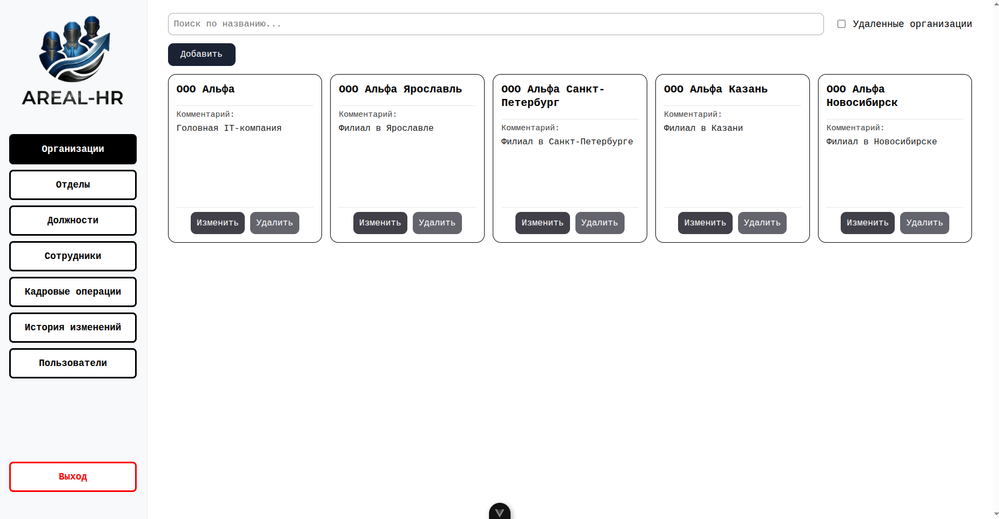
- «Отделы»
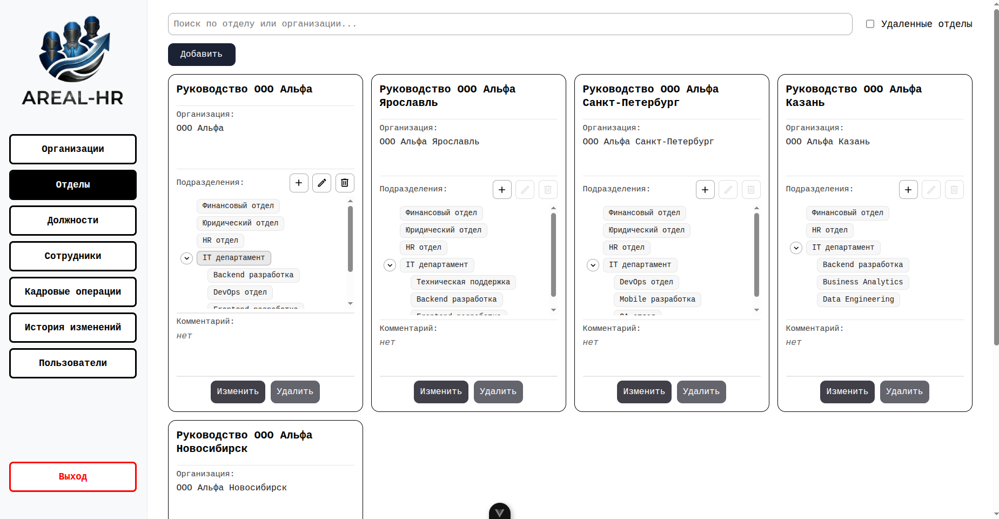
- «Должности»
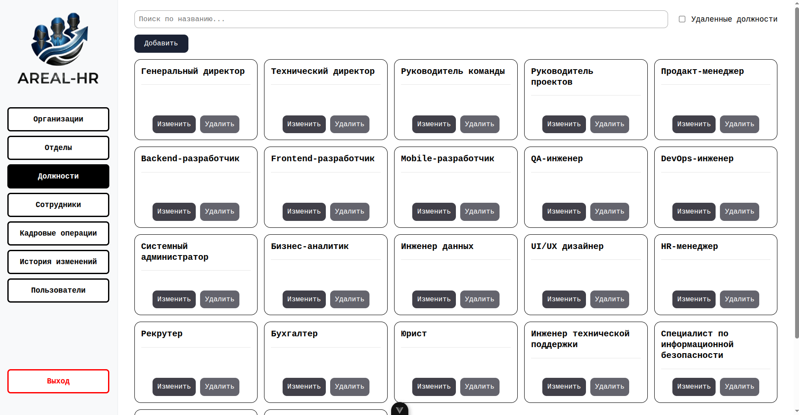
- «Сотрудники»
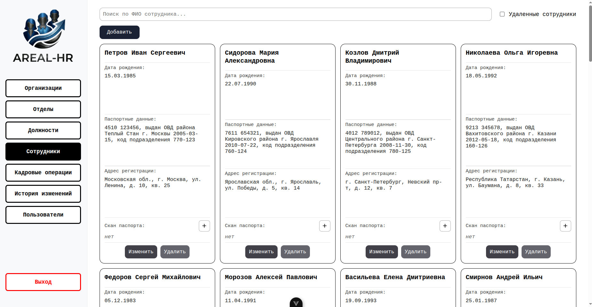
- «Кадровые операции»
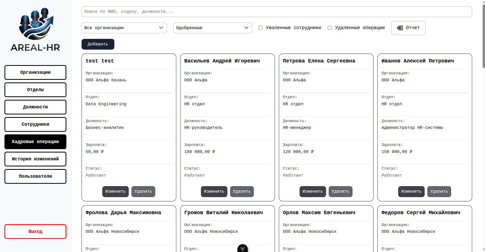
- «Пользователи»
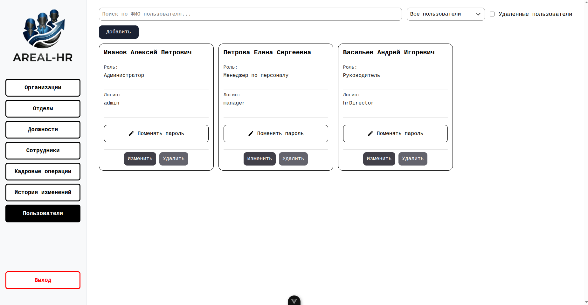

## 1. Добавление записей

1) На странице нажать кнопку «Добавить».
2) Ввести необходимые данные в открывшейся форме.
3) Нажать кнопку «Сохранить».

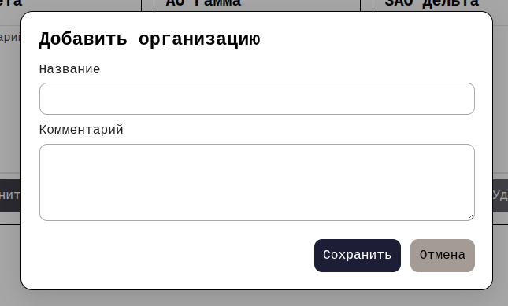

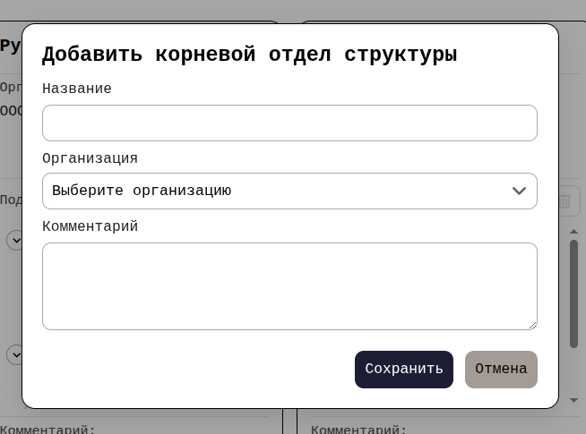

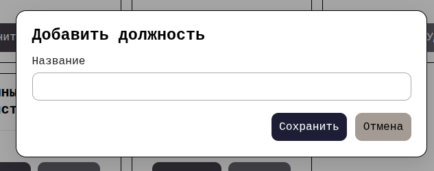

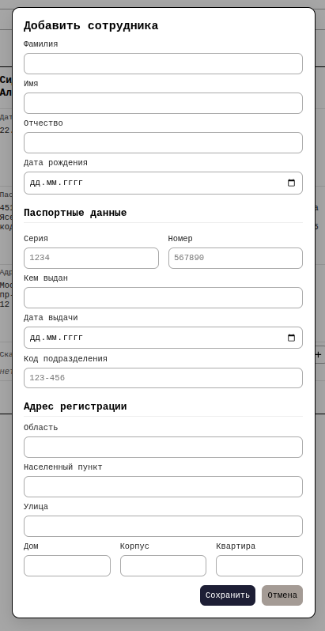

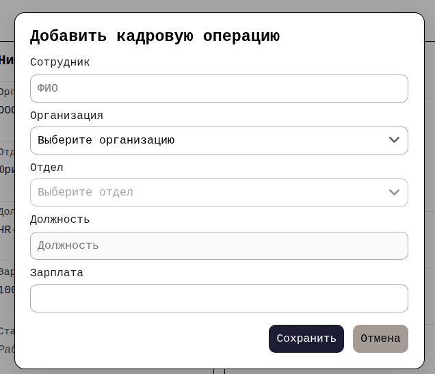

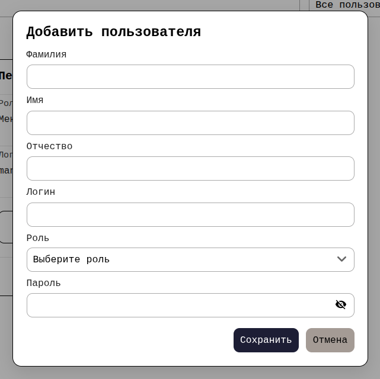

## 2. Изменение записей

1) Нажать кнопку «Изменить» у карточки.
2) Изменить данные в форме.
3) Нажать кнопку «Сохранить».

## 3. Удаление записей

1) Нажать кнопку «Удалить» у карточки.
2) Подтвердить удаление.

## 4. Добавление подразделения к корневому отделу структуры организации на странице «Отделы»

1) Нажать кнопку «+» у карточки отдела.
2) Ввести название подразделения.
3) Нажать кнопку «Сохранить».

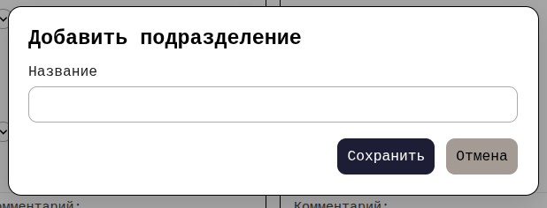

## 5. Изменение подразделения

1) Выбрать подразделение.
2) Нажать кнопку редактирования.
3) Изменить название.
4) Нажать «Сохранить».

## 6. Удаление подразделения

1) Выбрать подразделение.
2) Нажать кнопку удаления.
3) Подтвердить удаление.

## 7. Добавление скана паспорта сотрудника на странице «Сотрудники»

1) Нажать кнопку «+» у карточки сотрудника.
2) Выбрать файл и ввести название.
3) Нажать «Сохранить».

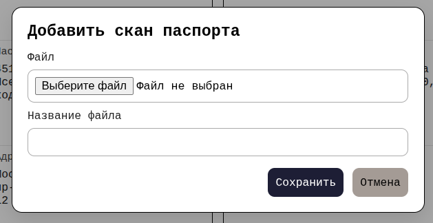

## 8. Удаление скана паспорта

1) Нажать на крестик рядом с файлом.
2) Подтвердить удаление.

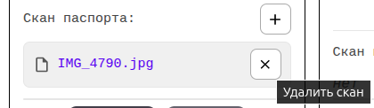

## 9. Изменение пароля пользователя на странице «Пользователи»

1) Нажать на кнопку «Поменять пароль» у карточки.
2) Ввести новый пароль.
3) Нажать «Сохранить».

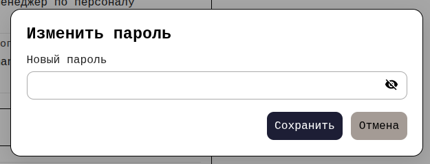

## 10. Восстановление удалённых записей

1) Поставить галочку «Удаленные организации/отделы/должности/сотрудники/операции/пользователи»
2) Нажать на кнопку «Восстановить» у карточки.
3) Подтвердить восстановление.

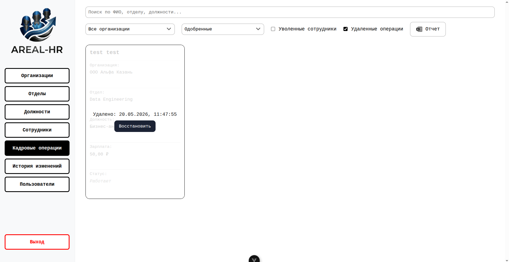

## 11. Фильтрация

- Поиск (на всех страницах): ввести запрос в поле поиска.
- На странице «Кадровые операции»:
    - отображение уволенных сотрудников: поставить галочку «Уволенные сотрудники»;
    - фильтр по организациям: выбрать организацию из выпадающего списка;
    - фильтр по статусу кадровых операций: выбрать статус из выпадающего списка.
- Фильтр по объектам на странице «История изменений»: выбрать тип объекта из выпадающего списка.
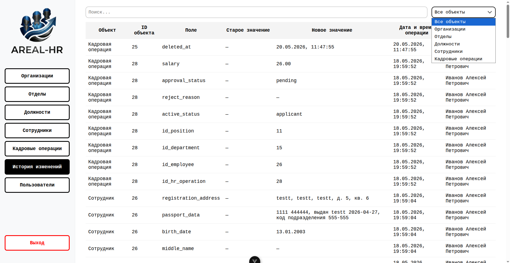
- Фильтр по ролям на странице «Пользователи»: выбрать роль из выпадающего списка.

## 12. Действия с отклоненными кадровыми операциями

- Удаление: нажать на кнопку «Удалить» и подтвердить удаление.
- Для отклонённых операций, связанных с изменением данных, предусмотрена возможность возврата к исходному состоянию (статус «Одобрено» и прежние данные) с помощью кнопки «Вернуть».

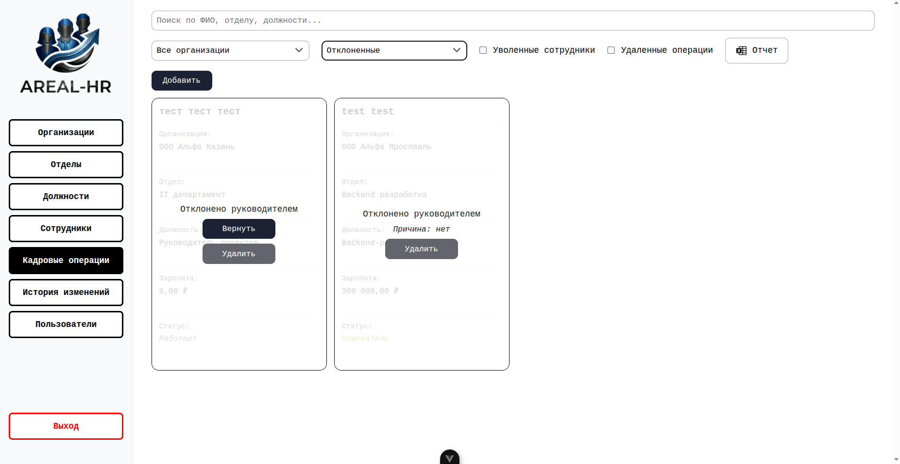

## 13. Формирование отчета на странице «Кадровые операции»

1) Применить нужные фильтры.
2) Нажать на кнопку «Отчет».

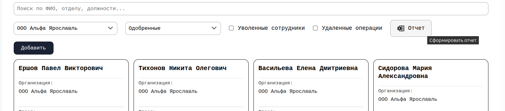

