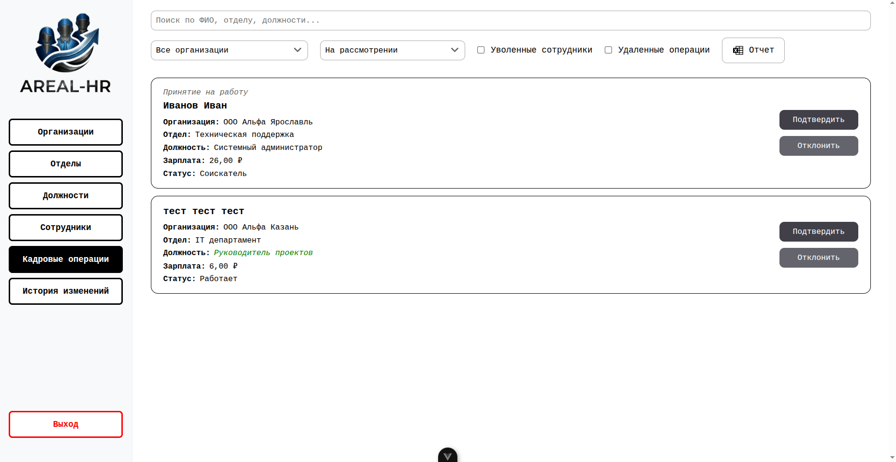
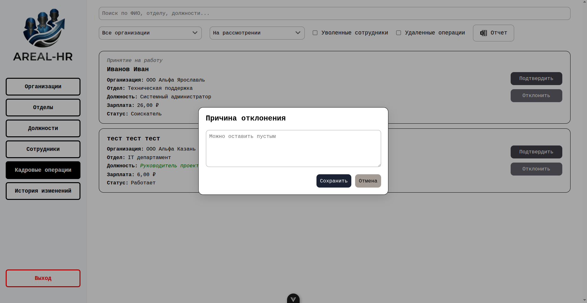

# Инструкция руководителя

## 1. Действия с кадровыми операциями

- Подтверждение: нажать на кнопку «Подтвердить» у рассматриваемой кадровой операции.
- Отклонение: 
  1) нажать на кнопку «Отклонить» у рассматриваемой кадровой операции;
  2) при необходимости указать причину отклонения;
  3) нажать на кнопку «Сохранить».

## 2. Формирование отчета на странице «Кадровые операции»

Выполняется аналогично пункту 13 [Инструкции администратора](./admin-guide.md).

## 3. Фильтрация

Выполняется аналогично пункту 11 [Инструкции администратора](./admin-guide.md).

